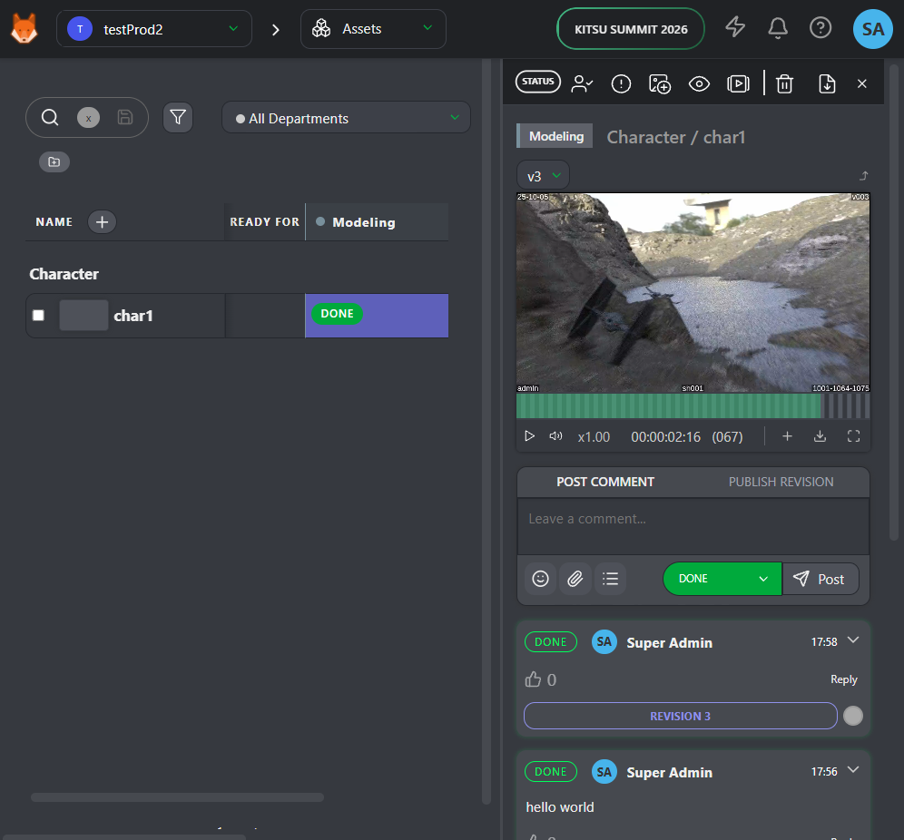

# Kitsu Docker (Production-Style Stack)

This Docker Compose stack runs **Kitsu** frontend, **Zou** backend, **Postgres**, **Redis**, **Meilisearch**, **nginx**, **Traefik**, Mailcatcher, and a Postgres backup container.

The repository is designed for a practical production-style deployment while still being easy to run locally at `http://localhost:8080/`. Images are published to GitHub Container Registry, so you do not need to build Kitsu or Zou locally for normal use.

## Screenshot



## Quick start

Clone the repository:

```bash
git clone https://github.com/Ahmed-Hindy/Kitsu-Docker-Prod.git
cd Kitsu-Docker-Prod
```

Create a local environment file if needed:

```bash
cp .env.example .env
```

For a local workstation, the important values are:

```env
DOCKER_HOST_IP=127.0.0.1
KITSU_WEB_HOST_PORT=8080
ZOU_API_HOST_PORT=5001
KITSU_DOMAIN=localhost
```

For a LAN machine, set `DOCKER_HOST_IP` and `KITSU_DOMAIN` to the host IP or DNS name you want other machines to use.

Generate a strong value for `ZOU_SECRET_KEY` before using this outside local testing:

```bash
openssl rand -hex 32
```

Pull images and start the stack:

```bash
docker compose --env-file .env --env-file versions.env pull
docker compose --env-file .env --env-file versions.env up -d
```

Open Kitsu:

```text
http://localhost:8080/
```

Default local login values are controlled by `.env`:

```env
ZOU_ADMIN_EMAIL=admin@example.com
ZOU_ADMIN_PASSWORD=mysecretpassword
```

Change these before using the stack for anything important.

## Public routing with Traefik

Traefik exposes the stack on the configured HTTP and HTTPS ports:

```text
http://<KITSU_DOMAIN>/
https://<KITSU_DOMAIN>/
```

Use a real DNS hostname that points to this host for Let's Encrypt certificates. A LAN IP address can work for plain HTTP routing, but public certificate issuance requires a DNS name.

## Backups

This stack runs automatic Postgres backups in a separate `db-backup` container.

The main settings are:

```env
BACKUP_CRON=30 1 * * *
BACKUP_RETENTION_DAYS=14
```

See [`docs/backups.md`](docs/backups.md) for manual backup, listing, copy, and restore instructions.

## Updating Kitsu and Zou

Application versions are pinned in [`versions.env`](versions.env):

```env
ZOU_VERSION=v1.0.52
KITSU_VERSION=v1.0.48
```

To update Kitsu or Zou:

1. Edit `versions.env`.
2. Commit and push the change.
3. GitHub Actions builds and publishes new GHCR images.
4. Pull and restart the deployment:

```bash
docker compose --env-file .env --env-file versions.env pull
docker compose --env-file .env --env-file versions.env up -d
```

## How this stack differs from the official all-in-one image

The official `cgwire/cgwire` image is useful for quickly trying Kitsu in one container. It bundles the application pieces together and can be started with a simple `docker run` command.

This repository is different. It separates the main services:

- `kitsu-web` for the frontend
- `zou-api` for the backend API
- `zou-events` for event streaming
- `db` for Postgres
- `redis` for the key-value store
- `meilisearch` for indexing
- `nginx` for local app/API routing
- `traefik` for public HTTP/HTTPS routing
- `db-backup` for scheduled database backups
- `mailcatcher` for local email testing

That separation makes the stack easier to operate, debug, back up, and extend, but it also means configuration matters more than with the all-in-one image.

## Development notes

The current hardening plan is documented in [`docs/implementation-plan.md`](docs/implementation-plan.md).

Before committing changes, run:

```bash
docker compose --env-file .env --env-file versions.env config --quiet
sh scripts/smoke-test.sh
git status --short
```
